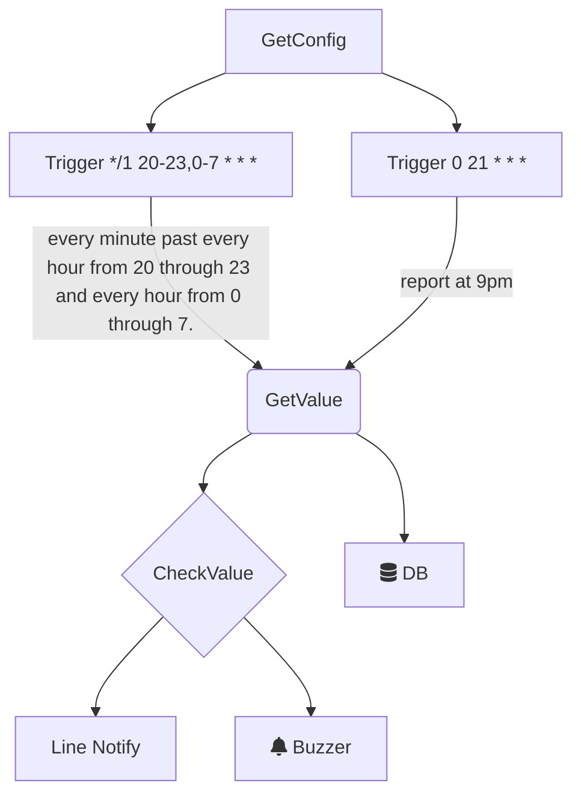

#transmitter
#### Mysql or Postgres Usage:
```go
import ( 
	Pkgsql "transmitter/sql"
)
var mysqler PkgSql.Database = PkgSql.NewMysql()
Mysqler.ParseConfig(map[string]interface{}{
	"dbusername": "XXX",
	"dbpassword": "XXX",
	"protocol":   "tcp",
	"host":       "xxx.xxx.xxx.xxx",
	"port":       3306,
	"database":   "XXX",
	"charset":    "utf8",
	"location":   "Asia%2FTaipei",
	"parsetime":  true,
})
err := mysqler.Conn()
if Pkgtools.NewHandle().Retry(err, 5, time.Second*1, mysqler.Conn, func() {
	fmt.Println("database alive")
	}, func() {
		fmt.Println("database dead already")
	}) {
		return
	}
for _, v := range w.wSensors.Sensor {
	if v.Value != nil {
	query:=fmt.Sprintf("INSERT INTO record VALUES (NULL,%d,%.2f,NOW())", v.DbID, v.Value)
	err := mysqler.Insert(query)
		if err != nil {
			continue
		}
    }
}
defer mysqler.Close()
log.Println("Write mysqler success")
```
#### Make ModbusRtu with CRC-16:
```go
var rtu PkgModbus.Modbus = PkgModbus.NewRtuCmd()
rtu.SetCmd(func(cmd string) []byte {
	data := strings.ReplaceAll(cmd, " ", "")
	output, err := hex.DecodeString(data)
	if err != nil {
		fmt.Println(err)
	}
	return output
}("01 03 00 00 00 02"))
rtu.GetCmd()
```
#### Write Serial or ModbusTCP(TCP incomplete):
```go
var Serialer PkgModbus.Transmit = PkgModbus.NewRSerial(v.Name, v.Port, v.Baud, time.Millisecond*1000)
Serialer.Conn()
Serialer.Flush()
Serialer.Write(rtu.GetCmd())
data, err := Serialer.Read()
fmt.Println(data,err)
Serialer.Disconn()
```
#### FlowChart


#### docker compose healthcheck(dockerTest):
    if database failure return exit(1) success return exit(0)
    
    when using docker container ls will output:
    
	CREATED         STATUS                   PORTS                               NAMES
	3 minutes ago   Up 3 minutes (healthy)   0.0.0.0:3306->3306/tcp, 33060/tcp   yongfeng_mysql
	3 minutes ago   Up 3 minutes (healthy)                                       yongfeng_golang
#### docker container relationship
[](https://github.com/tomoffice/transmitter/blob/origin/docker-compose.png?raw=true)
